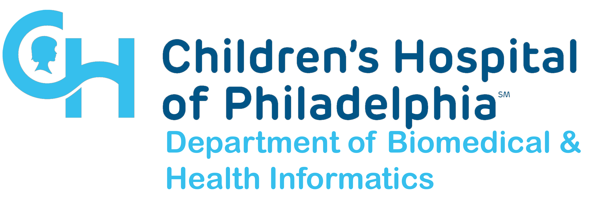

# DBHi Days Bioinformatics Retreat DNA Methylation Breakout

Slides and demo code from my breakout talk on DNA methylation processing and analysis at CHOP's 2024 DBHi Retreat.

**Repository Contents**

- `2024-10-17_dbhi_retreat_meth_breakout_group.pdf` PDF of slides shown during the breakout
- `01_processing` example code for processing DNA methylation data
  - `arrays` example code for processing Illumina methylation arrays
  - `bisulfite` example code for processing bisulfite sequencing (BS-Seq) reads
- `02_analysis` example code and demo data for analyzing reduced representation bisulfite (RRBS) data

---
